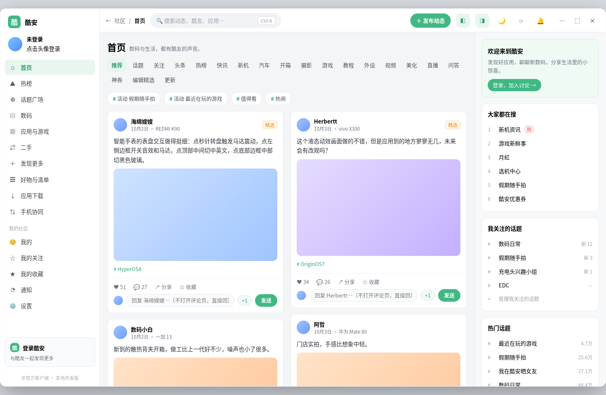

<div align="center">

# 酷安 Windows 单文件版

**非官方酷安 Windows 桌面客户端**　·　免安装 **单文件 exe**　·　无边框圆角窗口



</div>

> [!IMPORTANT]
> 本项目是社区维护的**非官方**客户端，与酷安官方及深圳酷安网络科技有限公司无隶属、授权或合作关系。
> 酷安名称、Logo 及相关商标归其权利人所有。

## 下载

到 [Releases](https://github.com/SymonChu/coolapk-windows/releases/latest) 下载 `coolapk-windows.exe`：**免安装、免解压**，双击即运行。
依赖系统自带的 WebView2（Windows 10/11 一般已内置）。

## 界面

三栏布局：**左侧导航 ／ 中间信息流 ／ 右侧栏**。首页已按 `prototype/home.html` 重排：**大标题 + 热词胶囊 + 整页换行的栏目胶囊行 + 白底圆角卡片**。


*上图是客户端前端的实际渲染（本地快照，未登录状态）。*

- **左侧导航**：可**收起为图标栏**，导航项含首页、热榜、话题广场、数码、应用与游戏、二手、好物与清单、应用下载、手机协同，以及「我的社区」分组（我的 / 我的关注 / 我的收藏 / 通知 / 设置）
- **中间**：顶部是「首页」大标题 + 副标题 + 热词胶囊 + 换行的栏目胶囊行（推荐 / 关注 / 头条 / 热榜 / 快讯 / 新机 …）；信息流可切「双列」，两列**各自独立滚动、互不干涉**
- **右侧栏**：欢迎卡、本月热榜、**我关注的话题**、热门话题，可**整块隐藏**
- 顶部栏右侧的右栏开关控制右侧栏显隐；左侧栏用侧边栏边缘的折叠手柄收起

### 自有功能

| 功能 | 说明 | 状态 |
|---|---|---|
| **快捷回复** | 每条动态下方一个输入框 + 「发送」按钮，**不用打开评论页**就能直接回复（旁边另有 `+1` 快捷按钮） | v0.2.0 起在客户端里可用 |
| **我关注的话题** | 首页右栏集中展示已关注话题（服务端给出未读数时才显示角标），底部可进入管理 | v0.2.0 起在客户端里可用 |
| **双列各滚各的** | 信息流切到「双列」后是两个**独立滚动**的瀑布流，滚动其中一列不影响另一列 | v0.2.0 起 |
| **左右栏显隐** | 左侧可**收起为图标栏**；右侧由顶栏开关**整块隐藏** | v0.2.0 起 |
| **首页照稿重排** | 大标题 + 热词胶囊 + 整页胶囊栏目行 + 白底圆角卡片（不再是上游那条细标签条与贴边卡片） | v0.3.0 起 |

设置里都有对应开关：`设置 → 外观` 下的「快捷回复」「我关注的话题」；顶栏的右栏开关在首页显示。

`prototype/home.html` 是本次重排的**可交互**界面稿：下载后用浏览器打开，点顶栏那两个开关可以自己试显隐；也支持用 `?state=hide-left,hide-right` 预设状态。

## 当前状态

| 已经打通 | 还在做 |
|---|---|
| 工程底座（Tauri 2 + Vue 3 + Rust），只保留 Windows 目标 | 首页以外的页面（详情 / 话题 / 设置等）仍是上游样式 |
| 无边框窗口 + 圆角，单文件 exe 打包（不打安装器） | 圆角在 Windows 10 上的表现待实机验证 |
| GitHub Actions 自动构建并发布单文件 exe（打 `v*` tag 自动发 Release） | 快捷回复、我关注的话题、新首页真机验收 |
| 构建后**启动自检**：在构建机上真跑一次 exe，并倒出启动日志 | |
| **首页照稿重排**（大标题 / 热词胶囊 / 整页胶囊栏目行 / 白底圆角卡片） | |
| **快捷回复**、**我关注的话题**、**双列独立滚动**、**右栏开关**已接入客户端 | |

也就是说：**首页已经按界面稿重排完成**；其余页面（动态详情、话题、设置等）仍沿用上游样式，尚未逐页重绘。

## 来源与致谢

本项目基于 **[daimiaopeng/coolapk-desktop](https://github.com/daimiaopeng/coolapk-desktop)**（MIT 许可证）改造：

- 保留其 Rust 端的酷安 **Token V3 兼容签名**、**官方授权登录**、**API / 会话请求层**；
- 在此基础上改名、裁剪为 Windows 单文件版，并按自有设计重做界面。

原项目的版权与许可声明见 [`LICENSE`](LICENSE)、[`NOTICE.md`](NOTICE.md)。
第三方品牌、Logo、表情及服务端内容**不在** MIT 授权范围内。

## 构建

环境：Node.js ≥ 22、Rust stable、[Tauri 2 系统依赖](https://v2.tauri.app/start/prerequisites/)、WebView2 Runtime。

```bash
npm install
npm run tauri build -- --no-bundle    # 只出单文件 exe，不打包安装器
```

产物：`src-tauri/target/release/coolapk-windows.exe`（免安装，双击运行）。

推送 `v*` 形式的 tag 时，GitHub Actions 会自动构建并把单文件 exe 挂到 Release 上。

## 目录结构

```
src/                     Vue 3 / TypeScript 前端
src-tauri/src/coolapk/   Rust：签名 auth.rs ／ 接口 client.rs ／ 命令 commands.rs
prototype/               界面稿（home.html 可交互 + 渲染图）
docs/preview/            README 使用的渲染截图
.github/workflows/       仅 Windows 的构建与发布流程
```

## 排障

**双击 exe 没反应？** 看 exe 同目录（该目录不可写时退到系统临时目录）的
`coolapk-windows-启动日志.txt`，里面逐行记录了启动到哪一步，能直接看出卡在哪。

**登录态 / 设置存在哪？** `%APPDATA%\com.coolapk.windows` —— 删掉这个目录相当于把客户端恢复出厂设置。

**换了版本要重新登录？** 应用数据目录跟随应用标识走。标识一旦变更，就是一份全新的数据目录，旧的登录态不会自动继承。

## 许可证

代码采用 [MIT 许可证](LICENSE)；第三方品牌与内容归属见 [`NOTICE.md`](NOTICE.md)。
