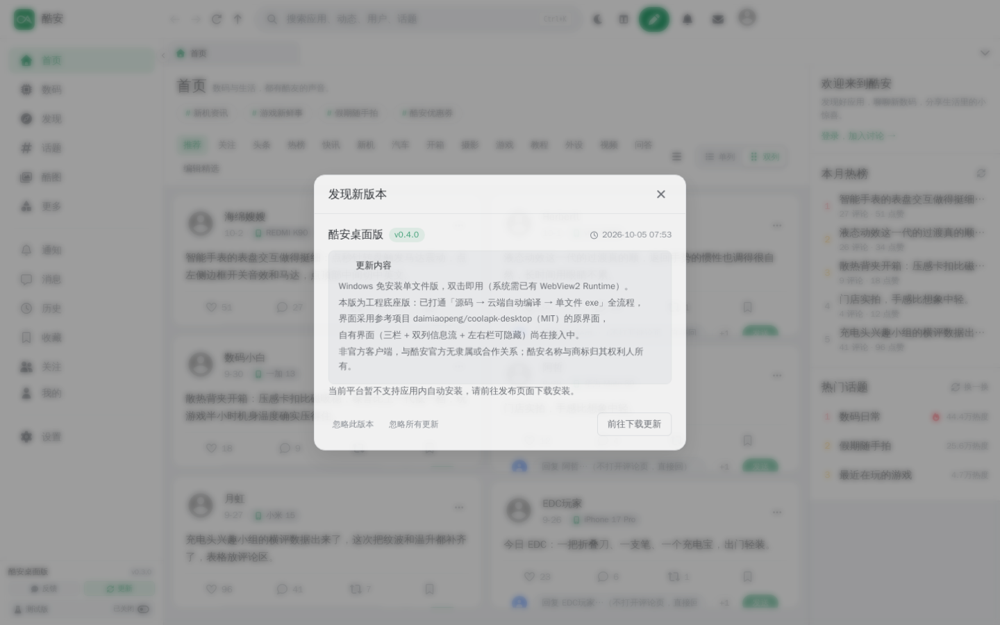
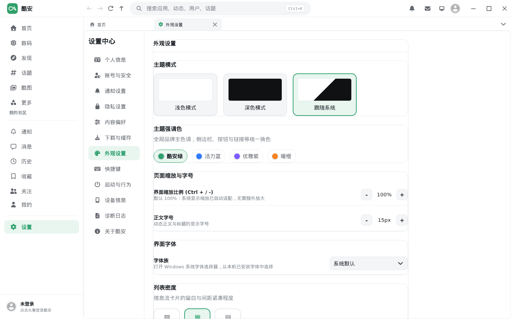

<div align="center">

# 酷安 Windows 单文件版

**非官方酷安 Windows 桌面客户端** · 免安装**单文件 exe** · 无边框圆角窗口



</div>

> [!IMPORTANT]
> 本项目是社区维护的**非官方**客户端，与酷安官方及深圳酷安网络科技有限公司无隶属、授权或合作关系。
> 酷安名称、Logo 及相关商标归其权利人所有。

## 它是什么

一个 Windows 桌面上的酷安客户端：**一个 exe 文件，双击就能用**，不需要安装、不需要解压，也不需要额外的运行时（除系统自带的 WebView2）。

界面是**三栏结构**——左侧导航 / 中间信息流 / 右侧栏——并按 `prototype/home.html` 的设计稿重排了首页：

- 首页顶部有「首页」大标题 + 副标题 + 热词胶囊，下面是一整块**换行的胶囊栏目行**（推荐 / 关注 / 头条 / 热榜 / 快讯 …）
- 信息流是**白底圆角卡片**；切到「双列」后是**两个各自独立滚动的瀑布流**，滚一列不影响另一列
- 左侧导航可**收起为图标栏**；右侧栏可由顶栏开关**整块隐藏**

全站的配色、圆角、描边、标题层级、选中态**收敛在同一套令牌与统一皮肤里**，不是每个页面各写一份。

## 下载

到 [Releases](https://github.com/SymonChu/coolapk-windows/releases/latest) 下载 `coolapk-windows.exe`：
**免安装、免解压**，双击即运行。

- 依赖系统自带的 **WebView2**（Windows 10/11 一般已内置）
- 目前**未做代码签名**，首次运行可能被 SmartScreen 提示「未知发布者」——选择「更多信息 → 仍要运行」即可
- 应用数据（登录态、设置）在 `%APPDATA%\com.coolapk.windows`，删掉该目录相当于恢复出厂

## 界面



*以上两张截图都是**客户端前端的实际渲染**（本地快照，未登录状态），不是设计稿。首页那张是**双列**形态——也就是两个各自独立滚动的瀑布流；单列 / 双列可在信息流右上角切换。*

*设计稿本身的可交互版本在 `prototype/home.html`，其渲染图在 `docs/preview/home.png`。*

| | |
|---|---|
| **左侧导航** | 首页 / 热榜 / 话题广场 / 数码 / 应用与游戏 / 二手 / 好物与清单 / 应用下载 / 手机协同，以及「我的社区」分组；可收起为图标栏 |
| **中间** | 首页大标题 + 热词胶囊 + 胶囊栏目行；信息流单列 / 双列可切，双列时两列各自独立滚动 |
| **右侧栏** | 欢迎卡、本月热榜、我关注的话题、热门话题；可整块隐藏 |
| **顶栏** | 前进 / 后退 / 刷新、搜索、发布、通知、消息、深浅色切换、右栏显隐开关、窗口按钮 |

`prototype/home.html` 是首页的**可交互设计稿**：用浏览器打开后，点顶栏那两个开关可以自己试左右栏显隐；也支持 `?state=hide-left,hide-right` 预设状态。

## 自用增强

在官方客户端行为之上，这个版本加了这些（都在设置里可关）：

| 功能 | 说明 | 起始版本 |
|---|---|---|
| **快捷回复** | 每条动态下方一个输入框 + 「发送」按钮，**不用打开评论页**就能直接回复（旁边另有 `+1` 快捷按钮） | v0.2.0 |
| **我关注的话题** | 首页右栏集中展示已关注话题（服务端返回未读数时才显示角标），底部可进入管理 | v0.2.0 |
| **双列各滚各的** | 信息流切「双列」后是两个独立滚动的瀑布流，任一列触底才续页 | v0.2.0 |
| **左右栏显隐** | 左侧收起为图标栏；右侧由顶栏开关整块隐藏 | v0.2.0 |
| **首页照稿重排** | 大标题 + 热词胶囊 + 整页胶囊栏目行 + 白底圆角卡片 | v0.3.0 |
| **全站统一皮肤** | 品牌绿 / 圆角 / 描边 / 标题层级 / 选中态收敛成一套 | v0.4.0 |

开关位置：`设置 → 外观` 下的「快捷回复」「我关注的话题」；右栏开关在首页顶栏。

## 当前状态

| 已经打通 | 还在做 |
|---|---|
| 工程底座（Tauri 2 + Vue 3 + Rust），只保留 Windows 目标 | 各页面**各自的版式**仍是上游结构（本轮统一的是皮肤层，不是逐页重画） |
| 单文件 exe 打包（不出安装器） | Windows 10 上的窗口圆角表现待实机验证 |
| 推送 `v*` tag 自动构建并发布 Release | 快捷回复、我关注的话题、新首页的真机验收 |
| 构建后**启动自检**：在构建机上真跑一次 exe，跑不起来就拒绝发版 | |
| 首页照稿重排 + 全站统一皮肤 + 上面那几项增强 | |

*说明：界面统一是「一套令牌与皮肤 + 统一覆盖各页面重复写法」，没有逐页重写版式；「我的」页那类官方风格的多彩图标等页面细节保持原样。*

## 来源与致谢

本项目基于 **[daimiaopeng/coolapk-desktop](https://github.com/daimiaopeng/coolapk-desktop)**（MIT 许可证）改造：

- 保留其 Rust 端的酷安 **Token V3 兼容签名**、**官方授权登录**、**API / 会话请求层**；
- 在此基础上改名、裁剪为 Windows 单文件版，并按自有设计重排界面、统一皮肤。

原项目的版权与许可声明见 [`LICENSE`](LICENSE)、[`NOTICE.md`](NOTICE.md)。
第三方品牌、Logo、表情及服务端内容**不在** MIT 授权范围内。

## 构建

环境：Node.js ≥ 22、Rust stable、[Tauri 2 系统依赖](https://v2.tauri.app/start/prerequisites/)、WebView2 Runtime。

```bash
npm install
npm run typecheck          # 类型检查
npm test                   # 单元测试
npm run tauri build -- --no-bundle    # 只出单文件 exe，不打包安装器
```

产物：`src-tauri/target/release/coolapk-windows.exe`。

推送 `v*` 形式的 tag 会触发 GitHub Actions：构建 → 在构建机上真跑一次 exe（启动自检）→ 通过后把单文件挂到 Release。

## 目录结构

```
src/                     Vue 3 / TypeScript 前端
src/styles/              设计令牌（tokens/themes）与统一皮肤（draftSkin.css）
src-tauri/src/coolapk/   Rust：签名 auth.rs ／ 接口 client.rs ／ 命令 commands.rs
prototype/               首页设计稿（home.html 可交互 + 渲染图）
docs/preview/            README 使用的实际渲染截图
.github/workflows/       仅 Windows 的构建与发布流程
```

## 排障

**双击 exe 没反应？** 看 exe 同目录（该目录不可写时退到系统临时目录）的
`coolapk-windows-启动日志.txt`，里面逐行记录了启动到哪一步，能直接看出卡在哪。

**登录态 / 设置存在哪？** `%APPDATA%\com.coolapk.windows`。

**换了版本要重新登录？** 应用数据目录跟随应用标识走；标识一旦变更就是一份全新目录，旧登录态不会自动继承。

## 许可证

代码采用 [MIT 许可证](LICENSE)；第三方品牌与内容归属见 [`NOTICE.md`](NOTICE.md)。
