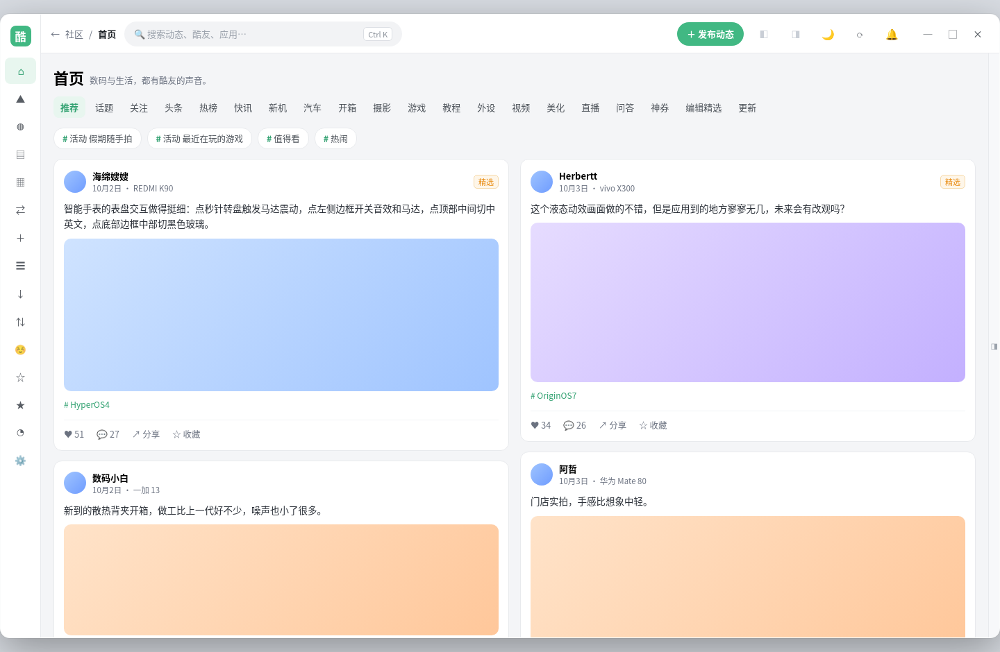
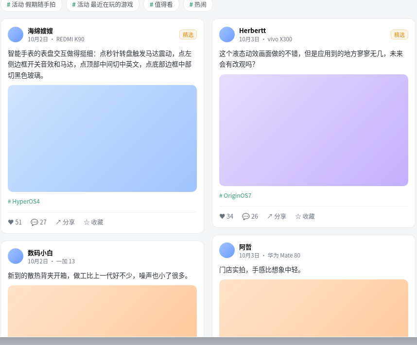

<div align="center">

# 酷安 Windows 单文件版

**非官方酷安 Windows 桌面客户端**　·　免安装 **单文件 exe**　·　无边框圆角窗口


</div>

> [!IMPORTANT]
> 本项目是社区维护的**非官方**客户端，与酷安官方及深圳酷安网络科技有限公司无隶属、授权或合作关系。
> 酷安名称、Logo 及相关商标归其权利人所有。

## 界面

中间是**两个不同内容的信息流并排**（左「推荐」图文卡片流 ／ 右「关注」列表流），**各自独立滚动、互不干涉**。
左侧导航可**收起为图标栏**，右侧栏可**整块隐藏** —— 顶部栏两个开关切换，开关底色即当前状态。

| 隐藏左右栏（信息流自动变宽） | 中间信息流特写 |
|---|---|
|  |  |

`prototype/home.html` 是**可交互**的界面稿：下载后用浏览器打开，点顶栏那两个开关可以自己试显隐。

## 当前状态

| 已经打通 | 还在做 |
|---|---|
| 工程底座（Tauri 2 + Vue 3 + Rust），只保留 Windows 目标 | 界面稿尚未接入工程（当前运行的仍是上游界面） |
| 无边框窗口 + 圆角，单文件 exe 打包（不打安装器） | 登录 / 接口层与自有界面的对接 |
| GitHub Actions 自动构建并发布单文件 exe（打 `v*` tag 自动发 Release） | 圆角在 Windows 10 上的表现待实机验证 |
| 构建后**启动自检**：在构建机上真跑一次 exe，并倒出启动日志 | |

## 来源与致谢

本项目基于 **[daimiaopeng/coolapk-desktop](https://github.com/daimiaopeng/coolapk-desktop)**（MIT 许可证）改造：

- 保留其 Rust 端的酷安 **Token V3 兼容签名**、**官方授权登录**、**API / 会话请求层**；
- 在此基础上改名、裁剪为 Windows 单文件版，并按自有设计重做界面。

原项目的版权与许可声明见 [`LICENSE`](LICENSE)、[`NOTICE.md`](NOTICE.md)。
第三方品牌、Logo、表情及服务端内容**不在** MIT 授权范围内。

## 构建

环境：Node.js ≥ 22、Rust stable、[Tauri 2 系统依赖](https://v2.tauri.app/start/prerequisites/)、WebView2 Runtime。

```bash
npm install
npm run tauri build -- --no-bundle    # 只出单文件 exe，不打包安装器
```

产物：`src-tauri/target/release/coolapk-windows.exe`（免安装，双击运行）。

推送 `v*` 形式的 tag 时，GitHub Actions 会自动构建并把单文件 exe 挂到 Release 上。

## 目录结构

```
src/                     Vue 3 / TypeScript 前端
src-tauri/src/coolapk/   Rust：签名 auth.rs ／ 接口 client.rs ／ 命令 commands.rs
prototype/               界面稿（home.html 可交互 + 渲染图）
docs/preview/            README 使用的渲染截图
.github/workflows/       仅 Windows 的构建与发布流程
```

## 排障

**双击 exe 没反应？** 看 exe 同目录（该目录不可写时退到系统临时目录）的
`coolapk-windows-启动日志.txt`，里面逐行记录了启动到哪一步，能直接看出卡在哪。

## 许可证

代码采用 [MIT 许可证](LICENSE)；第三方品牌与内容归属见 [`NOTICE.md`](NOTICE.md)。
